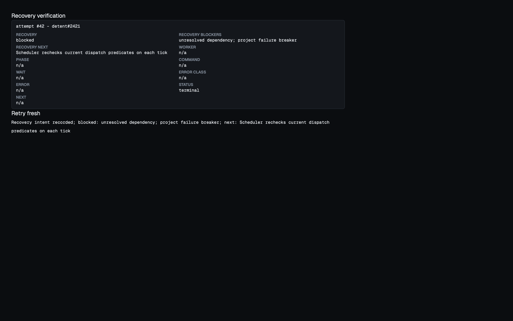

# Recovery convergence verification

- SQLite regressions reproduce a Todo issue with four acknowledged parks and a closed dependency, including stale runtime holds and later park generations.
- Public orchestrator recovery API tests submit four concurrent retry requests and assert one worker start. Restart boundaries close and reopen SQLite after intent persistence, tracker mutation, and retry queuing.
- Independent dependency, budget, project-outage, stale-tracker, and invalid-configuration predicates prevent scheduler dispatch. Multiple causes remain visible together.
- Failed journal writes preserve existing holds. A newer attempt supersedes old retry intent. Stale acknowledgement writes cannot lower the durable sequence or replace its timestamp.
- Real runner model-selection tests distinguish unsupported effort from catalog outage. Configuration completion tests cover typed, wrapped, and restored errors; preflight checks avoid repeated launches.
- Focused tests passed for orchestrator, runner, store, and web. Focused recovery race tests passed. `make generate` passed. Full `make check` and current-head CI remain required before handoff.

Browser verification used the real receipt and recovery handlers through a temporary Go overlay and an ephemeral HTTP listener. Chrome showed both blockers, the next recheck, and neutral blocked feedback after Retry fresh. The preview exited successfully after the browser closed. The live process was untouched.

Skill draft: no — existing recovery and isolated-preview skills cover the method.
