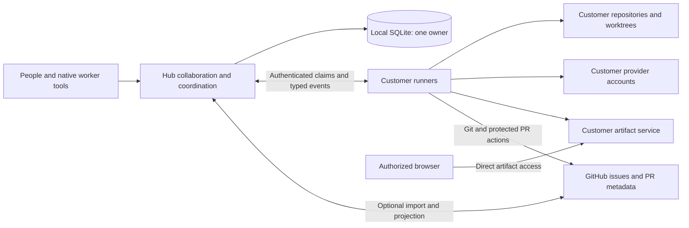
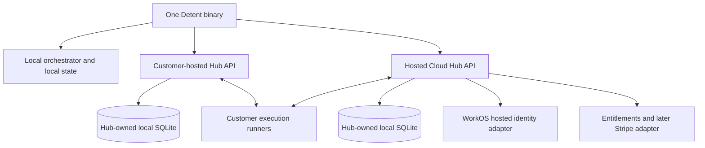
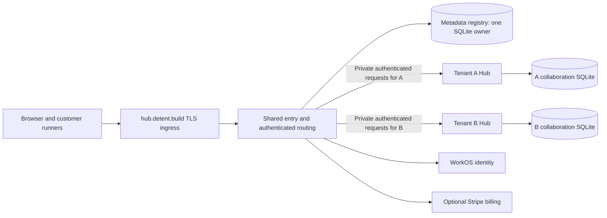
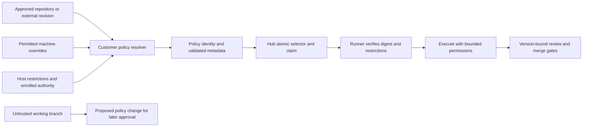
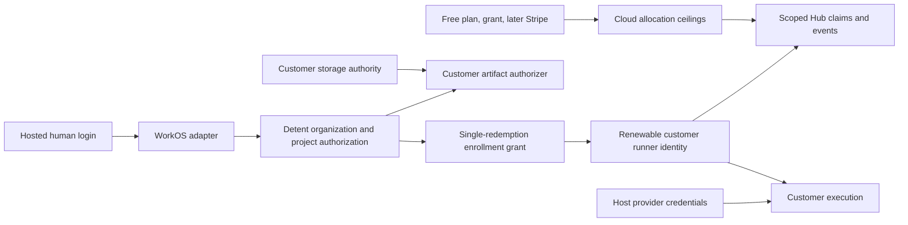
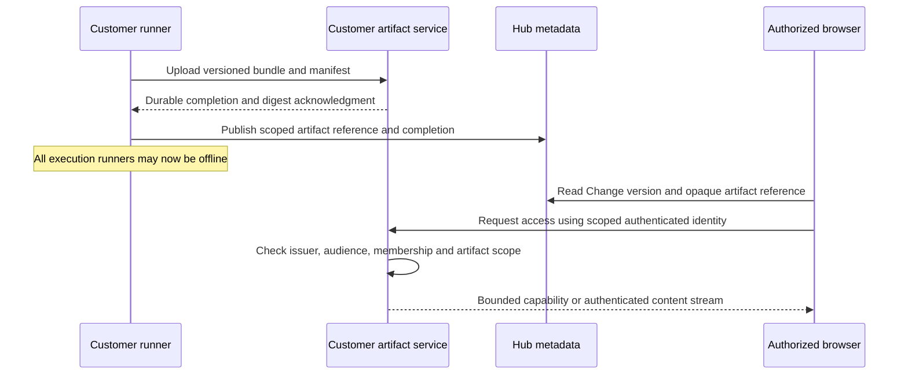
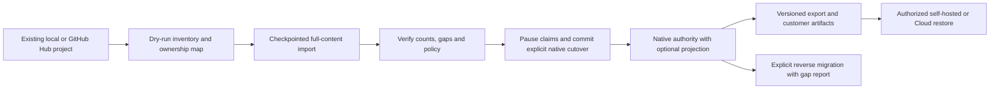
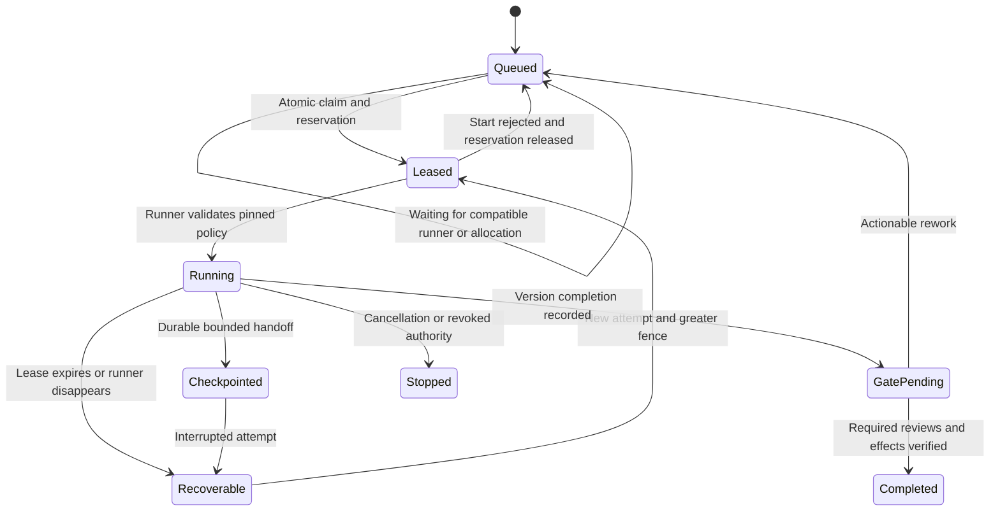
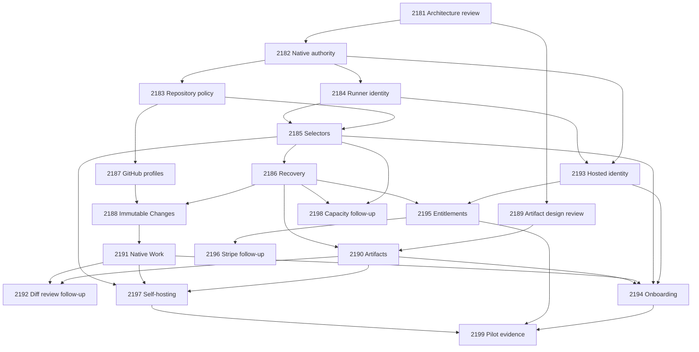

# Native Hub and Detent Cloud architecture RFC

[Documentation index](../README.md#documentation) · [Implemented Hub API](hub-api.md) · [Original delivery #2181](https://github.com/digitaldrywood/detent/issues/2181) · [Shared-site correction #2340](https://github.com/digitaldrywood/detent/issues/2340)

Status: proposed architecture for human review. This is the authoritative design
target for the linked Cloud work once reviewed; it does not claim those features
exist today. The current API reference describes shipped behavior. Review this
RFC before dependent implementation. The RFC can finish independently of every
implementation below.

Detent remains a Go agent orchestrator delivered as one binary. Local operation,
a customer-hosted Hub, and the shared hosted service at `https://hub.detent.build`
are supported directions. Hosted access has organization free/paid entitlements.
Self-hosted Detent is free with customer-selected authentication, including WorkOS,
custom, generic or local options; it never requires a Detent hosted account,
subscription, or billing connection. WorkOS is optional for self-hosting. Customer
machines execute work using customer provider accounts;
Detent does not resell provider keys. This document authorizes no live accounts,
DNS changes, deployment, purchases, invitations, or customer charges.

## Decision status and release boundary

The issue confirms native ownership of complete issues, comments, dependencies,
workflow, execution history, and Change Requests; optional GitHub integration;
named/tagged runners and explicit machine selection; existing repository policy
compatibility; durable access to uploaded artifacts with runners offline; WorkOS
for hosted identity; limited free access, complimentary grants, and later Stripe
subscriptions. Native diff review is the immediate follow-up to the first release,
not a first-release dependency.

The protocol rules below are proposals to approve with this RFC. They constrain
implementation without silently resolving the product choices in this table.

| Decision | Status and recommended direction | Decision owner/follow-up |
| --- | --- | --- |
| Billing boundary and teams | Approved September 7: organization billing; flat owner/admin/member/viewer roles with explicit project and separate runner-management grants. Nested teams and inherited permissions are deferred | Human product review; [#2193](https://github.com/digitaldrywood/detent/issues/2193), [#2195](https://github.com/digitaldrywood/detent/issues/2195) |
| Artifact deployment | Approved September 7: optional local-only operation, customer-managed storage, and explicit opt-in hosted storage through a portable service and configurable S3 adapter. DigitalOcean Spaces is the initial hosted provider | [#2190](https://github.com/digitaldrywood/detent/issues/2190); [artifact contract](artifact-access-contract.md) |
| Hosted tenant allocation | Approved September 7: one dedicated Hub process and SQLite file per organization, with persistent tenant binding and scoped APIs. Customer collaboration databases are not pooled; measure the per-process baseline cost | Human architecture/cost review; #2193, [#2199](https://github.com/digitaldrywood/detent/issues/2199) |
| Shared product entry | Confirmed September 8: one public origin for sign-in, organization creation/joining/switching and organization billing; supersedes per-organization public origins without changing tenant storage | [#2340](https://github.com/digitaldrywood/detent/issues/2340), #2341, #2342, #2343 |
| Pilot access | Recommend invitation-controlled pilot with configurable grants; eligibility and invitations remain operator decisions | #2194, #2195, #2199 |
| Prices and free allowances | No approved prices, permanent free quantities, unlimited tier, or marginal-cost promise. Measure baseline and marginal cost before public commitments | #2195, [#2196](https://github.com/digitaldrywood/detent/issues/2196), #2199 |
| Retention and deletion | Require explicit policies for collaboration, events, artifacts, and backups; durations, backup expiry, and revocation bounds remain unresolved | #2182, #2189, #2195, #2197 |

An unresolved choice blocks only the implementation that needs it. It is not a
dependency from this RFC back to that implementation. The first-release evidence
gate is #2199, including shared self-service hosting after #2342. The completed
test billing delivery #2196 is reused by live-mode/customer provisioning #2343;
paid activation is independent of the free pilot. Native diff rendering (#2192)
and capacity-based routing refinements (#2198) remain separate work.

## Existing implementation and superseded assumptions

Reinspected at `fafa74a3` (September 4, 2026):

| Evidence | Existing behavior | Remaining design gap |
| --- | --- | --- |
| [Hub API](hub-api.md), [database owner](../internal/hubserver/database.go), [migrations](../internal/hubserver/migrate.go) | One locked SQLite owner, HTTP clients, forward migrations, online backup | Portable native schema and migration/export procedures |
| [Scheduler](../internal/hubclient/scheduler.go), `FetchCandidateIssues` | Releases the claim when the mapped issue has no GitHub node ID | Native work-item identity must pass through scheduling and worker tools |
| [Tracker model](../internal/tracker/tracker.go), `WorkItem` | GitHub-shaped references and `BodyExcerpt` | Full body, comments, native history and organization/project scope |
| [Outbox](../internal/hubserver/outbox.go), `WorkEventChange` and `WorkflowStateChange` | Typed mutations retain GitHub mutation/label coupling | Native transactions without an obligatory external projection |
| [Worker API](../internal/hubserver/api_worker.go), [authentication](../internal/hubserver/api_auth.go) | Scoped worker/operator/admin tokens and fenced lease mutations | Enrollment, renewable identity, authenticated runner binding and tenant isolation |
| [Project loader](../internal/config/project_definition.go), [configuration](config.md), [multi-project operation](multi-project.md) | Split files, legacy frontmatter, local overrides, definition revisions and external definition roots | Trusted policy provenance, native runner selectors, pinned policy enforcement |

This RFC supersedes these assumptions from
[#2049](https://github.com/digitaldrywood/detent/issues/2049), specifically for
native projects:

1. GitHub Issues are the durable issue/collaboration authority. Native Hub records
   become authoritative; GitHub remains authoritative in compatibility projects.
2. Creating issues must remain a GitHub action, and full native authoring is a
   non-goal. Detent gains full issue and comment authoring.
3. Every work item needs a GitHub repository/node/issue identity and a mirrored
   excerpt. Native IDs and full content are required; external references are optional.
4. Meaningful workflow progress must always project to GitHub labels/workpads.
   Native writes commit without GitHub; projection is explicitly configured.
5. GitHub PRs are the only durable change/review record. Native Change Requests
   and immutable versions own native review, while external branch protections
   remain authoritative for a GitHub merge.
6. Mirror freshness is a general scheduling prerequisite. It applies only to
   externally owned inputs/actions; native readiness never needs fresh GitHub issues.

Retain #2049's single SQLite owner, narrow tracker boundary, atomic claims,
monotonic fencing, durable history, scoped authentication, webhook inbox,
idempotent outbox, bounded repair, Board/List shared state, and fresh merge safety
checks. Active-active writers, shared database mounts, a database replacement,
and automatic raw workspace/transcript custody remain out of scope. This RFC
does not expand into every feature of a general project-management suite.

## Ownership and deployment contract



| Data or action | Native authority and custody | Compatibility profile |
| --- | --- | --- |
| Full issue body, title, comments, authorship, dependencies, workflow, priority, queue | Hub, including revisions and provenance | GitHub owns issue content/lifecycle and configured status; Hub owns coordination and explicitly Hub-managed fields |
| Runs, attempts, leases, typed history, policy digest, checkpoints | Hub stores bounded metadata and customer artifact references | Same Hub coordination foundation |
| Change Request, immutable versions, native discussion/reviews | Hub; GitHub PR reference optional | PR integration preserves GitHub's review/check authority |
| Source, worktree, raw diff/transcript, screenshots/video | Customer infrastructure by default | Same boundary |
| Provider and repository execution credentials | Customer host credential facilities | Same boundary |
| Storage credentials and download capabilities | Customer artifact authorization service; never ordinary Hub metadata | Same boundary |
| Hosted identity and entitlements | Cloud adapters and scoped Detent records | Not required for local/self-hosted use |

Customer-submitted issue/comment text is Cloud data and can contain code, secrets,
or other sensitive content. Full native authoring therefore cannot promise that
Cloud never receives code. Imports deliberately copy selected issue/comment text
and must disclose that. Structured run events must not automatically copy raw
prompts, workflow prose, tool output, local paths, or artifact contents. Redaction
is useful but is not proof that arbitrary user text contains no sensitive data.

Cloud does not automatically clone repositories or collect raw source, diffs,
transcripts, screenshots, video, provider keys, or storage credentials. A user
deliberately quoting code in a review comment creates collaboration data. A
separately opted-in hosted artifact mode changes custody under the September 7
approval; ordinary Hub metadata still excludes raw artifact content.
Cloud-controlled browser code and dispatch are trust surfaces; encryption and
customer storage do not prove the Cloud operator can never access customer code.



Each Hub process alone opens its database. Remote clients use authenticated HTTP;
no SQLite file is shared over NFS/SMB, and no replicated writers are added. Hosted
placement retains one organization per dedicated Hub process and SQLite file.
The September 8 correction separates that storage boundary from the public site:
all customer application navigation uses `https://hub.detent.build`
(external identity/payment screens return to this same origin). A shared entry service
owns authentication, organization selection, provisioning and trusted routing.
It does not open tenant databases. Tenant filters remain mandatory.

The previously delivered reserved bootstrap user, immutable public-origin binding
and cross-origin directory are migration inputs, not the self-service launch
contract. Stable organization/provider bindings remain enforced; removing their
checks globally is prohibited. See [identity migration](hosted-identity.md#existing-origin-migration)
and [deployment examples](examples/hub/README.md).

Preserve startup ownership locks, schema identity checks, WAL, foreign keys,
busy-timeout handling, and fail-closed migration/version checks. Health becomes
ready only after ownership and schema validation. Backups use the owner's online
backup path; do not copy live database/WAL files. Recovery starts a replacement
only after the previous owner is fenced off. A reverse proxy may terminate TLS
under the existing trusted-proxy contract. Self-hosted endpoints and identity
adapters are configurable; no compiled-in Cloud login or billing requirement.

## Shared-site control and tenant storage

This September 8 design is proposed for review in #2340. #2341 implements shared
routing, #2342 provisioning/lifecycle and #2343 customer billing. It does not
claim those implementations or any live deployment are complete.



The registry is a separate, single-owner local SQLite service at the baseline.
Other processes access it through authenticated bounded APIs, never a shared
mount. Registry records allow only stable Detent/provider user and organization
IDs, verified identity fields needed for account administration, organization
names for the chooser, membership status/revision mappings, provisioning intents
and checkpoints, allocation IDs/private endpoints/generations, non-secret
runner/service principal-to-organization routing references, tombstones,
versioned plan references and Stripe account/environment/customer references.
Authentication state and encrypted provider credentials needed for login live in
a private auth store with explicit retention, not in operator reports. Minimal
hashed invitation/operation references permit recovery; raw invitation tokens,
session capabilities and secrets never enter the reporting registry schema.
The entry service exclusively owns the auth store; other services use its private
validated-session API for continuing authorization, not a second SQLite handle
or copies of the operator WorkOS key. Restoring auth storage invalidates sessions.

Project grants and all issues, comments, run history, policies, source/artifact
references and artifact bytes remain in their owning tenant/service. The registry
must not replicate collaboration content, arbitrary metadata maps, project
search indexes, credential material or provider payloads. Counts/health use the
existing bounded tenant metadata API. A membership mapping is a routing candidate,
not authorization: current provider membership, local revocation and tenant
project grants must still agree. Unknown, stale or conflicting bindings fail
closed. Registry unavailability denies new routing/provisioning; already admitted
work follows its existing lease and safe checkpoint rules, never another tenant.

Only the entry service resolves an immutable organization ID to an allowlisted
allocation endpoint. It validates the route and caller before routing, including
current membership for browser authority and independent credential binding for
machines/services. The tenant checks its persisted organization/allocation generation
and project/operation authority. Neither client headers, Host, return URLs, JSON
IDs nor provider metadata may supply an upstream address or filesystem path.
Use private authenticated transport (mTLS between services, or an equivalently
reviewed local Unix-socket identity) plus a short-lived signed request assertion.
Bind the assertion to issuer, exact tenant audience, organization, allocation
generation, actual/effective principal, session/credential ID, method, canonical
path, body digest, issued/expiry times and replay identity. Expiry is at most
30 seconds and never extends underlying authority. Tenants validate all fields;
mutation retries use their existing idempotency journal after fresh authorization.
Key rotation permits bounded overlap, and replayed transport assertions are denied.
For SSE the assertion admits the connection only; ongoing session/membership and
revocation checks authorize every frame and idle heartbeat independently.

Ingress strips all inbound internal identity/forwarding headers and sets only
trusted transport metadata. Backend listeners are private, firewall-restricted
or socket-permission restricted, and reject missing/invalid assertions even on
loopback. A public proxy-header-only bypass is never supported. Separate principals
limit allocator, registry, reporter and tenant access; a reporter cannot mint
browser or runner assertions. TLS termination alone is not proxy authentication.

Browser sessions, CSRF, invitations, scoped routes, SSE and artifact grants are
specified in [hosted identity](hosted-identity.md#shared-origin-route-and-session-contract).
Runner and integration credentials remain independently authenticated and
organization-bound; a browser session cannot confer machine authority.

## Provisioning, recovery and capacity

The durable lifecycle is `requested -> allocating -> ready`, with `failed` for a
recoverable or terminal failure and `deleting -> deleted` for retirement. Record
step, attempt count, next retry, bounded error code and allocation generation.
The verified creator sees the same operation after refresh/login; failure never
requires another organization ID. [Onboarding](cloud-onboarding.md#organization-provisioning-and-recovery)
defines the checkpoints and user-visible outcomes.

Before creating external resources, atomically reserve a finite organization
slot, allocation concurrency, measured memory headroom and local disk/backup
budget. Apply per-identity signup limits and operator eligibility policy; invitation
control can bound a pilot without manually assigning each tenant's YAML. Reject
new admission with a retryable capacity result before disrupting ready tenants.
A durable reservation is tied to the intent and fenced allocator lease. After a
crash, reconcile actual process/disk/provider state before releasing it or starting
a replacement; an expired timer alone cannot prove a live owner is gone.

Dedicated processes and separate databases are the baseline even when idle.
Measure shared entry/registry overhead separately from each tenant's startup peak,
idle and active RSS/CPU, file descriptors, connections/SSE, database/WAL growth,
backup staging/retention, network and optional artifact relay. Capacity is bounded
by the tightest measured memory, CPU, disk, descriptors and service limits with
explicit reserve. Record workload, hardware, binary revision, concurrency,
measurement window and calculation inputs in #2199/#2308. Publish the maximum
admitted tenants and allocation refusal result, not an unmeasured cost promise.
No existing snapshot of free RAM is an admission measurement.

Process pooling or on-demand activation is a separate reviewed lifecycle design.
It needs evidence for activation latency and stampedes, exclusive database
ownership, idle eviction with SSE/leases/jobs, drain/fencing, crash/restart,
webhook delivery, backup/restore, quota fairness and secret isolation. Do not
silently pool collaboration databases or promise pennies to reduce memory cost.

Backups pair a registry checkpoint and per-tenant owner-produced snapshots in a
manifest with organization, allocation generation, schema, restore epoch and
checksums. Quiesce provisioning/membership changes and relevant tenant writes for
a consistent capture; do not claim cross-database atomic snapshots. Keep deletion
and revocation ledgers outside rollbackable snapshots. Restore fenced/isolated,
verify registry-to-tenant bindings, reconcile provider and billing references,
reapply tombstones/revocations, rotate restored authority and runner credentials
under the existing recovery contract, then publish a new allocation generation.
Missing or conflicting records leave only the affected tenant unavailable;
never guess ownership or serve a restored deleted organization.

Organization deletion requires a current, non-impersonating owner, fresh identity
verification and explicit confirmation. Mark `deleting`, deny new allocations,
invitations and writes, revoke sessions/grants/enrollment, and drain or safely
stop active work. Reconcile/cancel paid service before retiring its billing
mapping. Fence the Hub and disable routing before the storage owner erases tenant
content, artifacts under the selected custody contract, exports and backups under
the approved retention policy. Keep minimal deletion/billing references needed
to reject delayed events and restoration; IDs are never reused. Failed erasure
stays visible as pending, not deleted. Customer-managed artifacts and external
GitHub projections require their own authorized owner actions. Policy durations,
retained billing records and recovery objectives must be published before launch;
this RFC invents none and performs no erasure.

Account deletion is distinct: revoke all that account's sessions and memberships
across organizations and remove its grants without deleting other members' work.
A last owner must transfer ownership to another verified member or complete
organization deletion first. Preserve opaque authorship attribution as required
by the tenant retention contract; remove account profile/provider identity only
after membership cleanup and documented retention checks. Cross-service failures
remain a resumable deletion operation. Re-creation never restores old grants.

## Stable identities and protocol compatibility

The native protocol uses opaque immutable IDs generated by the owning authority,
independent of hostnames, repository slugs, issue numbers, or provider node IDs.
UUIDs with typed prefixes are a recommended wire encoding, not new configuration
syntax. IDs survive rename, supported export/import, and migration; authorization
always checks scope, even when the caller knows an ID.

| Identity | Scope and lifetime |
| --- | --- |
| `organization_id` | Stable security namespace, mapped to optional WorkOS organization IDs; external identity provider changes do not reidentify it |
| `project_id` | Belongs to one organization; display key and repository bindings can change; moving between organizations requires explicit migration |
| `repository_id` | Stable optional repository binding; host/owner/name/remote URL are attributes, not work identity |
| `work_item_id`, `comment_id` | Stable native records; readable issue number is project-scoped and never substitutes for identity |
| `change_id`, `version_id` | Stable Change Request and immutable version; a new head creates a new version, never edits the old version |
| `machine_id`, `runner_id` | Physical host registration and logical executor; names mutable, identity not transferred on reinstall without authorized replacement |
| `run_id`, `attempt_id`, `session_id` | Logical execution, one ownership attempt, and backend session respectively; retry/reassignment creates a new attempt |
| `event_id`, `artifact_id`, `policy_id` | Immutable event, opaque customer artifact reference, and approved policy identity |

External references are optional typed records with provider, installation/account
scope, object kind, stable external ID, source revision, locator, and import or
projection provenance. Deduplicate by provider/scope/kind/ID. A transferred GitHub
issue updates its locator without becoming a new native issue. A repositoryless
native task and a Change without a PR are valid. Cross-organization dependencies,
runner claims, and artifact references are denied; cross-project dependencies
require access to both projects and transactional cycle checking.

Existing `/api/v1` GitHub-compatible clients must keep their semantics. Introduce
a separately negotiated native protocol major (proposed `/api/v2`) instead of
silently reinterpreting v1 fields. A capability handshake reports supported
protocol majors, event schema versions, required features, size limits, and
server identity. Claims require a common major and all job-required capabilities.
Unknown optional response fields can be ignored; unknown mutation fields, event
types, required capabilities, or incompatible major versions fail explicitly.
No fallback to GitHub identity or a separate local scheduler on negotiation failure.

Minor versions may add optional fields with safe defaults. Meaning changes,
required-field additions, or weaker safety semantics need a new major or explicit
capability. Maintain v1 during opt-in migration; removal requires a documented
support window and client inventory, not an assumed duration. Database schema
versions are separate from HTTP/event versions. Cursor tokens bind organization,
authorized project scope, query, ordering and protocol version; scope changes or
expired cursors require a fresh authorized query.

## Typed mutations and durable event contract

Native issue creation/editing, comments, dependencies, workflow transitions,
reviews and execution events use separate typed operations. There is no generic
GitHub proxy or arbitrary JSON state-mutation endpoint. Mutable collaboration
records carry a revision; edits supply `expected_revision`, returning a conflict
with the current revision instead of last-writer-wins data loss. Retries supply
an idempotency key scoped to actor, organization and operation; identical retries
return the committed result, different payloads using that key conflict.

All durable state changes, their event and any configured outbox entry commit in
one owner transaction. Events have `event_id`, `organization_id`, `project_id`,
`aggregate_type`, `aggregate_id`, monotonic `aggregate_sequence`, `type`,
`schema_version`, server `recorded_at`, authenticated `actor`, and a typed `data`
payload. Client `occurred_at` is informational, never ordering authority. Worker
events also identify `work_item_id`, `run_id`, `attempt_id`, `runner_id`,
`policy_id`, `lease_id`, `authority_epoch`, and positive `fencing_token`. The
server derives actor identity from
authentication and verifies every supplied scope and lease binding.

| Event type (schema 1 proposal) | Required typed data and validation |
| --- | --- |
| `issue.created`, `issue.edited` | Content revision, changed field names and content-record reference; full text belongs in versioned collaboration records |
| `comment.created`, `comment.edited` | Comment ID, revision, parent reference if any; explicit authored text, with imported author/source provenance preserved |
| `dependency.changed` | Related work-item ID, add/remove enum, expected graph revision; scope and cycle check |
| `workflow.transitioned` | From/to state IDs, expected item revision, typed reason; validate configured transition and review authority |
| `run.started`, `run.checkpointed`, `run.finished` | Attempt, backend/model/role, effective policy identity; checkpoint artifact references or bounded handoff, typed terminal result |
| `lease.reassigned` | Previous and next attempt/runner, new fencing generation; server-authored only |
| `change.version.created` | Change/version IDs, repository, base/head/merge-base commit IDs, policy identity, artifact manifest reference |
| `review.recorded`, `check.recorded` | Immutable version/head, authenticated principal/source, decision/conclusion enum, expected check/workflow identity; no arbitrary success assertions |
| `artifact.upload.completed` | Artifact/manifest ID, digest, byte count, media type and durable-store acknowledgment; never a bearer URL |

IDs and timestamps are strings, timestamps use RFC3339 UTC, revisions/sequences
are positive integers, byte counts are nonnegative integers, and references are
typed IDs rather than arbitrary URLs. Encode 64-bit sequence/revision/fencing
integers as decimal strings on the wire so browser clients do not lose precision.
`actor` contains `kind` (`human`, `runner`, `integration`, `system`) and a scoped
`principal_id`. The discriminant `(type, schema_version)` selects a closed payload
schema; it is not a free-form `map[string]any` contract.

Schema 1 terminal run outcomes are `succeeded`, `failed`, `cancelled`, and
`interrupted`; a successful worker run does not imply that review/merge gates
passed. Dependency operations are `add`/`remove`. Review decisions are `approve`,
`request_changes`, and `dismiss`; check conclusions are `passed`, `failed`,
`cancelled`, or `skipped`, with pending checks represented separately. Only the
configured accepted conclusion can satisfy a required check. Checkpoint resumption
is `resume_session`, `fresh_checkout`, or `manual_recovery`, accompanied by scoped
artifact references and the reason when required. New enum values require schema
negotiation; unknown values cannot be interpreted as success or permission.

Schemas reject unexpected content fields and enforce negotiated byte/count limits.
Progress payloads are bounded structured facts, not model transcripts. Finite
limits are required; the initial values and retention are reviewable configuration
decisions. Imported authors remain provenance, never authenticated Hub actors.
Transport is at least once: durable event IDs and command keys suppress duplicates,
server sequence orders accepted changes, and callbacks for an older attempt or
version cannot finish a newer one. Consumers resume from authorized cursors; a
retention gap returns an explicit snapshot/resync requirement.

Append-only audit semantics must coexist with export and deletion. Ordinary
clients cannot rewrite audit history. A separately authorized retention/deletion
procedure must redact or remove content and preserve permitted tombstones,
including backup expiry and restoration rules. Current append-only triggers are
not a complete deletion implementation; #2182 and #2197 must define and test it.

## Project profiles and GitHub request budgets

Choose one ownership profile per project. Do not expose unrelated switches that
make both systems independently authoritative for the same field.

| Profile | Issue authority and ingestion | Scheduling and outward integration |
| --- | --- | --- |
| `native` (proposed) | Hub owns full content, discussion and workflow. Explicit import/intake creates native records with provenance | No GitHub issue reads/writes needed for authoring, readiness, claims, progress or recovery. Optional coalesced projection and repository/PR/CI integration |
| `github_compatible` (proposed profile name) | GitHub owns issue content/lifecycle and configured status fields. Hub mirror, queue/dependency policy and leases retain current documented ownership | Webhooks, targeted hydration and bounded repair maintain external inputs; pending projections and stale required inputs remain visible |

These are design profile names, not accepted `tracker.kind` values today. Preserve
existing `github_local` operation and current Hub integration while introducing
them through #2187. Repository/PR/CI access is independent of native issue
ownership. A native project can use GitHub repositories and protected PR merges
without creating GitHub issues. Native review approval does not impersonate a
GitHub required review.

For native projects, external issue staleness affects import/projection health,
never native candidate freshness. Required PR checks or a deliberately declared
external dependency can still defer the affected action. In compatibility mode,
freshness policy is scoped to externally owned records and safety decisions;
failure in one integration must not pause unrelated native work.

The following are proposed engineering budget targets for #2187/#2199, not claims
about current measurements or provider quota guarantees. Account for actual
requests, GraphQL cost, retries, 304s and primary/secondary throttles. Classify by
organization, project, profile and operation; never log credentials or content.

| Operation | Budget contract and proposed pilot target |
| --- | --- |
| Native issue management, scheduling, heartbeat, progress | Exactly zero GitHub issue API requests when intake/projection is disabled, including after runner/Hub restart |
| Explicit import | One request per necessary page/object hydration plus bounded retries; persist cursors, source IDs and counts. No per-runner scans or automatic full reimport |
| Optional issue projection | Coalesce superseded values; at most one pending desired update per target/kind. Pilot target: at most one summary write per item per 60 seconds, with final-state flush accounted separately |
| PR/CI observation | Webhook first; deduplicate refresh by repository/PR/head across all runners. Pilot target: at most one refresh group per active PR per 60 seconds, excluding a fresh merge check; group cost reports its actual requests/pages |
| Incremental repair | One Hub-owned cursor per integration scope. Pilot target: 15-minute minimum interval and a 100-request/hour/integration ceiling shared with full repair; stop at the ceiling and preserve progress |
| Full repair | Explicit or slow bounded maintenance; pilot target: no more than daily automatic starts. Continue from checkpoint within the repair ceiling, with stale records visible |
| Merge | Reserve a bounded operation budget for fresh expected-head/review/check/branch-policy reads and one merge attempt. Pilot reservation: 20 requests per attempt; if complete verification needs more, defer or approve a larger configured bound, never truncate evidence |

All targets are configurable, and deployments sharing a credential need an
aggregate credential-wide budget in addition to per-project accounting. Queue
operations when budgets are exhausted, respect retry-after/reset signals, use
backoff and jitter, and cap retries. Prefer GraphQL for equivalent batch reads
when REST is constrained; do not treat either budget as unlimited. Idle runners
must not multiply GitHub request volume. Git transport, provider usage and
artifact traffic are measured separately from GitHub API requests. Reuse the
existing fanout fix [#2111](https://github.com/digitaldrywood/detent/issues/2111).

## Trusted project policy and runner selection

Repository `detent.yaml` and `WORKFLOW.md` remain the project contract, with
`detent.local.yaml`, `WORKFLOW.local.md`, legacy frontmatter, and explicit
external definition roots supported. `projects[].workflow` remains the anchor;
do not search a checkout for a competing higher-precedence file. The existing
parser merges local mappings over shared mappings, replaces explicitly supplied
scalars/sequences (including supported empty/false values), and appends local
workflow prose. Split configuration requires `schema: 1`; mixing structured
frontmatter with split files is rejected. Preserve documented clearing semantics
and last-known-good behavior on invalid reload.

This minimal **current-parser example** is a `detent.yaml` fragment sufficient
for parsing, not a complete deployment or a native profile declaration:

```yaml
schema: 1
tracker:
  kind: github
  github_status_source: label
  repository: example-org/orders-api
agent:
  max_turns: 10
  auto_promote:
    enabled: false
gate:
  kind: command
  run: make check
```

Place prompt-only instructions in `WORKFLOW.md`. An optional current-parser
`detent.local.yaml` example is:

```yaml
schema: 1
agent:
  max_turns: 12
```

The equivalent legacy layout puts the shared mapping without `schema` between
`---` delimiters in `WORKFLOW.md`, with no `detent.yaml`. The examples do not
establish all runtime prerequisites or grant permission to weaken a review gate.
See [configuration](config.md) and [overlay semantics](workflow-overlays.md) for
the full current field surface, including named runner requirements and the
explicit repository-policy approval path and scoped runner enrollment. Authorized
tag placement remains the separate #2185 deliverable.

Configuration merging and security authority are different operations. The
proposed evaluation order is:

1. Resolve current parser defaults, shared repository policy and supported local
   overrides from the approved definition root. Runtime flag/environment/global
   precedence remains as documented for host settings.
2. Establish provenance: trusted repository commit on an administrator-approved
   ref, or explicitly approved external definition revision; record content digest,
   approver/trust source, parser version and allowed local override fields.
3. Permit local resource/path/backend adjustments only within that approval.
   Local prose is not an authorization channel. Existing local files remain
   supported; changes to privileged local settings require host administration.
4. Intersect project requirements with host restrictions, enrolled project access,
   Hub organization restrictions, runner permissions and resource/plan ceilings.
   Deny wins, required gates combine, and numeric maxima take the strictest bound.
   Contradictory mandatory settings produce a policy conflict, not silent fallback.
5. Pin the resolved `policy_id`, source revision and digest to the run/attempt.
   Hub receives validated routing/gate metadata; workflow prose, commands, local
   paths and secrets stay on customer infrastructure unless deliberately allowed.



An implementation branch, issue instruction or job-generated file cannot relax
host permissions, required human review, approved commands, merge authority or
privileged runner routing. A policy edit becomes active only through the trusted
revision/approval path. On resume, retain the pinned policy plus any newly imposed
restrictions or revocations; loosened policy requires explicit reauthorization
and a new recorded policy identity. A mismatched/missing policy stops dispatch
before credentials or work execution. Cloud UI explains provenance and can guide
file creation, but cannot silently override repository gates.

Preserve plan-review stops, configured gate kinds, human approval, automatic
promotion and opt-outs, CI/validator requirements, merge methods and repository
automatic-merge policy. Repository A can require human review while B permits
automatic merge after its checks, even on the same machine. A paid allowance or
organization default cannot override A's required approval.

Runner selection uses stable IDs and administrator-controlled tags. Proposed
semantics: tags are lowercase ASCII tokens using letters/digits and `-`, `_`, `.`,
trimmed and normalized at administration input; duplicate normalized tags collapse.
All required tags AND every explicit `runner_id`/`machine_id` constraint must match.
Display names are mutable and never selectors. An empty selector admits any
otherwise authorized compatible runner; an unknown ID/tag matches none and returns
a structured reason. Renaming preserves routing. Disabled, drained, offline or
unauthorized runners cannot receive new claims; no selector is silently widened.

Actual enrollment binds logical runners to a machine. Checked-in runner profiles
declare requirements, not physical registrations. Self-reported capabilities and
tags cannot grant access or privileged labels. Multiple runners on one machine
share enforced host capacity. Hub selection and reservation happen atomically
with the claim, including project/pool/host/backend limits; the runner rechecks
policy and capacity before execution. No eligible machine means queued work with
`runner_unavailable`, `selector_no_match`, or `policy_mismatch`, without consuming
execution failure retries. Draining allows active work to finish under policy;
revocation prevents new effects and requests safe stop/checkpoint.

## Identity, credentials and entitlements



| Credential/authority | Lifecycle and enforcement |
| --- | --- |
| Hosted human login | WorkOS is the chosen hosted adapter. Detent maps principals to stable organization/project grants, validates issuer/audience/session state, and enforces membership removal. Owner manages ownership, billing and organization lifecycle; admin manages membership and organization administration. Member collaborates and viewer reads only explicitly granted projects. Runner management requires a separate explicit grant; no role grants code credentials or privileged execution automatically |
| Runner enrollment | Short-lived, one redemption, bound to intended organization/project/machine registration scope; concurrent redemption has one winner. Expired enrollment does not expire an already valid runner identity |
| Runner identity | Separately renewable and revocable, generated/stored on the customer host. Server binds claims/events/heartbeats to it; changing JSON machine IDs cannot impersonate a host. Rotation/reinstall requires an auditable binding, not name reuse |
| Provider/repository credentials | Customer-managed login or keys in private host facilities, injected only into permitted execution. Never Hub, WorkOS profile fields, repository files or event logs. An environment variable is not isolation from code in the same execution context |
| Storage authorization | Customer-side credentials or workload identity; browser/upload capabilities scoped to project, artifact and operation. No bucket secrets or bearer URLs in Hub metadata |
| Entitlements | Versioned plan assignment, audited grant, later subscription state. These allocate hosted resources and never authorize provider spend, repository access or merge |

Authorization scopes queries, searches, caches, cursors, SSE, background jobs,
enrollment, claims, artifacts, exports and billing lookups. Guessing an ID must
not reveal another organization's existence/content. Revalidate membership and
runner authority on protected operations; define session/capability revocation
bounds in the identity and artifact designs. Billing administration alone does
not grant code credentials or privileged execution. Local/self-hosted auth stays
pluggable and independent of Detent Cloud. A customer-selected WorkOS adapter
may depend on WorkOS; custom/local authentication requires no WorkOS connection.
Authentication provider selection never enables hosted monetization. Legacy Hub
tokens need explicit overlap/rotation guidance, not silent invalidation.

### Approved operational reporting and support access

Routine staff identities, operator tokens and analytics may read only an explicit
metadata allowlist: stable account and organization IDs; verified account email
when required for support/billing; plan assignment; member/project/runner counts;
activity timestamps; aggregate resource usage and quota consumption; and bounded
service-health status. No free-form content or arbitrary metadata maps enter that
contract. The owning tenant Hub reports these values through authenticated
`GET /api/cloud/metadata`; analytics has no database handle or unrestricted query
API. The initial report contains opaque organization/provider IDs, active member,
project, runner and event counts, latest activity, database/WAL bytes, health,
versioned plan assignment, scoped grant expiry, allowance/consumption and bounded
request/artifact telemetry. Hosted mode initializes an operator-configurable pilot
free plan; missing allowances inside a plan mean zero. See [hosted allowances](hosted-allowances.md)
for enforcement, downgrade and reporting policy. The delivered owner-only
`GET /api/cloud/billing` exposes bounded tenant usage; the shared site scopes it
as `GET /api/cloud/organizations/ORG/billing`. Organization administration cannot
read project content without an explicit project grant.

Reports exclude issue/comment bodies and titles, repository names and paths,
prompts, source, diffs, logs, artifact references and contents, credentials, and
bearer capabilities. Reports have no content cache and carry `Cache-Control:
no-store`. Hosted service logs retain only timestamp, severity and a fixed event
message; they discard arbitrary messages, attributes and errors from lower layers.
Content-bearing native responses remain customer-only and are authorized before
idempotency replay, pagination or rendering. Hosted pages do not attach the local
instance dashboard, its process-wide caches, searches, SSE or operator tools.
The tenant activity stream emits only project-scoped counters and rechecks active
session/membership/grants before every frame. Artifact read grants bind to the
originating hosted session, including support impersonation. The artifact
authorizer rechecks session, membership and project read permission at redemption;
grants expire within one minute or the earlier session/retention deadline. The
bound artifact publisher has access only to service-scoped receipts and read
authorization. Viewer read grants do not grant project write permission.

Customer-content support requires a privileged WorkOS impersonation session.
Ordinary staff membership never authorizes customer content. Detent requires an
explicit support-actor allowlist, a CSRF-protected support start from that actor's
current staff session, a one-use browser transaction bound to the selected
organization, and matching signed-token, exchange and active-session actor data.
The effective customer's current role and explicit project/runner grants still
apply. Organization switching is disabled during impersonation. The temporary
indicator names the support actor and effective customer, shows absolute expiry,
and offers POST exit. Local logout revokes the local session first and requests
provider revocation. Provider errors fail closed.

WorkOS requires an impersonation reason and documents automatic expiry after
60 minutes. Detent preserves the provider's earlier expiry, never refreshes a
support session into an ordinary session, and accepts only the content-free
reason codes `customer-request`, `account-recovery` and `troubleshooting`. Support
staff enter one of those codes in WorkOS; customer text belongs outside the
operator audit. Audit records contain actual support actor, effective user,
organization, provider session ID, reason code, start/expiry, session end when
explicitly logged out, route template, opaque project ID and action metadata.
They never contain request bodies, query strings, credentials or bearer URLs.
See [WorkOS impersonation](https://workos.com/docs/authkit/impersonation) and
[session tokens](https://workos.com/docs/reference/authkit/session-tokens).

This is restricted application access with exceptional audited support access.
Database separation does not make infrastructure operators technically incapable
of reading hosted data. Customer-managed artifacts and opt-in hosted artifacts
have different custody boundaries; hosted artifacts do not automatically provide
operator-inaccessible encryption. This delivery makes no zero-knowledge claim.
Local and customer-hosted installations keep independent generic/local identity.
Deployment and WorkOS team configuration are documented in
[hosted identity setup](hosted-identity.md); no live WorkOS access is enabled by
this change.

Entitlement resolution uses a versioned free/paid base plus valid scoped
complimentary grants; subscription state changes the base, and grant expiry
returns to the applicable base. Administrative suspension and safety restrictions
take precedence over all allowances. Free access requires no card or Stripe
subscription. Concurrency reservations are atomic with dispatch, idempotent
retries do not double-count, and failed starts release reservations. Exhaustion
or downgrade defers new excess allocations while preserving safe checkpointing,
reading/export and account access. Meter projects/members/runners, concurrency,
API/events, collaboration bytes, and any hosted relay traffic as appropriate;
exact quantities and durations remain configurable decisions. Self-hosting/local
use neither Cloud billing calls nor hosted tier restrictions.

## Durable artifacts and immutable Changes

Hub stores opaque artifact IDs, owner/project, kind, versioned manifest reference,
digest, size, media type, upload/availability state and retention metadata.
Customer manifests carry filenames, source paths and bundle details. Never store
bucket credentials or reusable presigned download URLs as ordinary metadata.



The artifact service/authorizer must be independent of the execution runner.
Successfully uploaded artifacts remain readable with every runner offline;
runner-local-only or partially uploaded files carry explicit unavailable/pending
states and are not review-ready. A runner crash after durable upload but before
Hub publication requires idempotent manifest reconciliation; a claimed completion
without verified durable objects must not become available.

The [artifact access contract](artifact-access-contract.md) records the approved
September 7 direction and supersedes the earlier AWS-specific proposal. Optional
local-only operation needs no durable-storage setup. Customer-managed artifacts
and separately opted-in hosted artifacts use the same configurable S3-compatible
boundary, initially targeting AWS S3, Tigris and DigitalOcean Spaces. Spaces is
the confirmed initial hosted provider; the earlier Dropbox reference was a typo.
The adapter verifies required capabilities and rejects unsupported behavior.
API Gateway, Lambda and DynamoDB are not mandatory. The portable single-owner
SQLite artifact service/catalog remains available independently of runners.

Routine staff access remains metadata-only. Exceptional content access requires
scoped, audited WorkOS support impersonation under #2193; no blanket staff download
bypass is permitted. Hosted storage consumes the payment-independent #2195
allowance boundary for organization bytes, concurrent reservations, artifact/upload
limits and retention. Exact prices and limits remain operator configuration.
Downgrades do not silently delete existing artifacts. No automatic customer-to-hosted
migration or fallback is permitted.

Downloads go directly through the selected artifact service with a short-lived
opaque grant and current Hub authorization on every request. Storage credentials
remain with that service. Missing objects, revoked access, retention expiry,
incomplete uploads, corrupt content and outages have distinct outcomes. Content
and credentials must not enter ordinary Hub metadata or request logs.

A Change Request links native issues and runs to immutable versions identified by
repository, base/head/merge-base commits, policy identity, and manifest digest.
Native reviews, checks and evidence bind to that version. A new relevant head
requires a new version and approval reevaluation; stale callbacks cannot approve
the latest version. Check acceptance verifies source identity, expected check
set, head, run and workflow/config revision. Customer-run evidence is labeled as
such and cannot satisfy a policy requiring independent validation by assertion.

GitHub PRs remain optional references. GitHub merges still require its branch
protections and fresh expected-head checks; native approvals do not replace
required GitHub review. A non-GitHub merge needs the corresponding repository
adapter's expected-ref update and trusted validation. First release exposes Change
metadata/discussion/status and durable artifact links. #2192 subsequently renders
native diffs and version reviews from those same IDs/manifests, without a data
rewrite or dependency on Stripe.

## Migration, export and recovery boundaries



Migrate existing Hub rows additively with a durable old-ID/native-ID mapping;
preserve all client-visible identity aliases, dependency/lease/history links and
external references. Never renumber imported issues or create a second identity
on repeated imports. Introduce organization/project ownership before native
records; existing data requires an explicit administrator binding, not inference
from a caller's current login. Leave compatibility mode selectable throughout.

Import all retrievable full bodies, comments, dependencies, authors, timestamps
and source IDs using resumable pagination. Record unavailable historical edits,
deleted content, inaccessible objects and incomplete pages as gaps. An excerpt
or fetched first page is not a complete import. Reimport deduplicates source
records and never overwrites independently authored native discussion.

Cutover is explicit and checkpointed: inventory source ownership and permissions,
backup, drain or account for active leases, stop conflicting issue writers,
reconcile the final source cursor, verify counts/gaps, then transactionally select
native authority. After cutover, native worker tools read/write Detent. Subsequent
GitHub edits become configured intake/conflicts, not silent native overwrites.
Linking/closing the old issue is optional. Cross-system source quiescence cannot
be atomic with SQLite; detected late source changes require reconciliation.

Database migration is forward-only and refuses newer schemas. Rollback of
software may require a compatible backup; rollback to GitHub ownership is a
separate reverse migration/export, because native Change history, comments and
policy may not map losslessly. Never imply changing a profile flag undoes a
completed cutover or recreates lost external history.

Portable exports include schema/protocol versions, organization/project identity,
native content, revisions, events, dependencies, Changes/versions and artifact
references. Credentials are omitted; artifact bytes remain in customer custody
and need their own copy/access procedure. Restore/import must authorize the
destination owner, validate IDs/references, report unsupported fields and avoid
collisions with existing data. Moving an organization requires quiescing its old
writer and re-enrolling/rebinding clients; export does not license simultaneous
active authorities for the same project. Retention/deletion tombstones and backup
expiry must prevent a restore from silently reviving deleted data.

Hub restoration must fence every pre-restore lease/credential session through a
new authority epoch and explicit client reconciliation. Restored integer fencing
counters alone can repeat values issued after the backup. Compare both epoch
and generation for native attempts, never trust a restored lease as current, and
reconcile externally completed effects before requeueing. This is required
follow-up behavior, not a claim that current backup support implements it.

## Lease and failure-state contract



The sole Hub owner atomically selects compatible work, reserves capacity, and
issues a monotonically increasing fencing generation. Renew/release/event writes
verify authenticated runner, attempt, expiry, generation and authority epoch in
the same transaction. A superseded worker cannot mutate current history or finish
a successor's work. Lease expiry preserves prior attempts, checkpoint references
and dirty-work evidence; it does not mean a local workspace survived machine loss.

Runners stop starting new external effects when lease validity cannot be proven
and stop/checkpoint execution according to host policy before expiry. They must
not start an independent local scheduler for the same Hub-owned project. Provider
requests already in flight and remote Git operations may still complete. SQLite
fencing does not make provider spending, pushes, PR creation or merges exactly
once. Use idempotency keys where supported, expected-ref/head checks, durable
intent/result records and reconciliation before retrying ambiguous outcomes.
Record residual windows honestly; never replay an unverified merge blindly.

| Failure | Required visible state and recovery |
| --- | --- |
| No matching runner or pinned host offline | Queued with selector/availability reason; preserve retry budget, no host fallback |
| Policy digest mismatch or invalid reload | Refuse start; retain last-known-good config and pinned active policy, explain source revision |
| Hub unavailable or network partition | Backoff; no new independent claims, stop new effects before authority expires; reconnect with current lease validation |
| Runner loss/expired lease | New fenced attempt receives issue, full discussion, run history and bounded checkpoints; resume only if backend/session/artifact state is actually available |
| Stale worker reconnect or duplicate completion | Reject stale mutations; identical committed retry returns prior result, never changes a successor |
| Missing local workspace/checkpoint | Explicit recreate/manual-recovery choice from policy; preserve dirty/unpushed evidence before cleanup, do not claim transparent resume |
| GitHub outage or exhausted budget | Native collaboration/dispatch continue; optional projection queues visibly; required external merge verification waits |
| Artifact upload/gateway/storage failure | Pending/unavailable/corrupt/expired state as appropriate; retry bounded uploads or access; metadata remains readable and absent evidence cannot pass review |
| Membership/runner revocation | Deny new protected actions and claims, invalidate or bound cached access, safe stop for affected attempts; billing role cannot undo revocation |
| Disk full, SQLite busy or owner conflict | No success before durable commit; health reports unavailable/degraded, no second writer; retry only with idempotent keys |
| Hub restart or backup restore | Restart validates surviving leases against server time; restore changes authority epoch and reconciles external effects before new claims |
| Plan limit or downgrade | Defer excess starts/allocations, permit safe completion/checkpoint and read/export; do not erase work or weaken repository safety |

Expose reason codes, owner/attempt/policy identity, lease status, integration
freshness, outbox lag, request budgets and artifact availability in existing
project/run/Fleet details. No false completed/review-ready state on missing
evidence. Lease timing uses server authority and parsed timestamps, not lexical
RFC3339Nano ordering or the runner's wall clock. Reuse existing recovery work
[#2138](https://github.com/digitaldrywood/detent/issues/2138) and
[#2133](https://github.com/digitaldrywood/detent/issues/2133) where applicable.

## Acceptance scenarios for implementations

These are future executable acceptance requirements, not results of this
documentation change. Use provider/integration fixtures and isolated ephemeral
services; the RFC author does not configure live customer accounts.

| Scenario | Evidence required |
| --- | --- |
| Local and self-hosted portability | Run custom/local auth with Detent Cloud, WorkOS and Stripe networking denied; auth/claims/recovery work without hosted entitlements. Separately use a WorkOS fixture with Cloud/Stripe blocked and verify auth choice does not enable billing |
| Shared-site journey | Execute the two-organization, concurrent-tab trace in [onboarding](cloud-onboarding.md#shared-site-acceptance-trace); all customer routes use hub.detent.build |
| Shared ingress isolation | Spoof headers/paths, replay assertions, bypass the entry service, change allocation generation and reuse cross-tenant cursors/grants; deny before content or mutation |
| Self-service recovery | Crash between each provider/registry/tenant commit, repeat creation concurrently, exhaust capacity, restore mismatched snapshots and replay deletion; no duplicate owner, tenant, customer or live SQLite writer |
| Cloud native work | Hosted fixture login, scoped organization/project, full native issue/comment/dependency edits, customer runner execution and Change creation; no external issue identity required |
| Compatibility coexistence | Native and GitHub-compatible projects run together; existing split/legacy/local/external-root configurations and GitHub-owned field semantics survive |
| Tagged and pinned runners | A targets one stable Mac machine; B requires Linux tags. Competing incompatible runners cannot claim either; rename preserves pin; offline/no-match waits with no widened selector |
| Shared-host capacity | Two logical runners on one host contend under one host ceiling; atomic reservations prevent overcommit |
| Two merge policies | Repository A requires human review; B permits automatic merge after checks. Run on the same fleet; A cannot merge without its approval, B obeys required CI/branch protection |
| Malicious policy edit | Job branch changes review/host/tag policy; pinned run rejects attempted relaxation and does not gain credentials or privileged routing |
| Offline uploaded artifacts | Complete durable upload, stop all execution runners, then read issue/history and fetch authorized logs/bundle. Expired membership loses access within the reviewed bound |
| Lease recovery | Contend for one item, expire/replace the winner, reject all stale writes and late completion; successor retrieves full native context and distinguishes missing workspace from resumable checkpoint |
| Restart/restore | Inject Hub restart and older-backup restore; preserve identities/history, change restore epoch, reject pre-restore attempts, reconcile external effects without duplicate merge |
| Version-bound review | New head invalidates relevant approval; stale check/review callback cannot approve current version; forged customer check cannot satisfy independent-validator policy |
| Low GitHub request count | Deny GitHub issue APIs after native cutover; exercise issue operations/recovery with zero issue calls. Compare one and ten idle runners under identical fixed workload: no extra GitHub polling; measure each operation against the budget table |
| Partial import and projection retry | Paginate interrupted import, preserve gaps/provenance, resume without duplicate comments; retry coalesced projection without overwriting native text |
| Tenant isolation and revocation | Attempt guessed IDs, cursor reuse, SSE/cache leaks, cross-project unauthorized dependencies and runner impersonation; deny without leaking content |
| Quotas and grants | Free/no-card access, scoped grant expiry, concurrent allocations, downgrade, read/export and safe completion; no provider credential or local safety bypass |
| Artifact/DB failure | Partial upload, missing object, corrupt digest, gateway outage and disk full never become completed evidence; idempotent retry converges |
| Export/deletion | Restore a versioned export into authorized self-hosting, inventory customer artifacts separately, and prove deleted content is not silently revived from backup |

#2199 publishes reproducible request counts, cost measurements, failure evidence,
known limitations and operator prerequisites. Measure compute, SQLite size/event
load, backup cost, network/relay traffic and support assumptions separately from
per-organization marginal cost. Browser acceptance belongs to implementation
issues, especially #2191/#2192/#2194; no UI change is made by this RFC.

## Implementation order and dependency contract

The following table and diagram preserve the original September 4 delivery graph
(19 issues, 32 edges). They are historical ordering, not current open blockers.
Dependencies are prerequisites, not a request to implement this whole table in
the RFC. The two design reviews precede their consumers. Current tracker state
and merged deliverables must be checked again before each implementation.

| Issue and deliverable | Direct prerequisites |
| --- | --- |
| [#2181 — original architecture RFC](https://github.com/digitaldrywood/detent/issues/2181) | None |
| [#2182 — native issues, comments and history](https://github.com/digitaldrywood/detent/issues/2182) | #2181 |
| [#2183 — repository workflow/policy compatibility](https://github.com/digitaldrywood/detent/issues/2183) | #2182 |
| [#2184 — scoped enrollment and runner identity](https://github.com/digitaldrywood/detent/issues/2184) | #2182 |
| [#2185 — runner names, tags and host selectors](https://github.com/digitaldrywood/detent/issues/2185) | #2183, #2184 |
| [#2186 — fenced native runs and recovery](https://github.com/digitaldrywood/detent/issues/2186) | #2185 |
| [#2187 — GitHub import/projection profiles](https://github.com/digitaldrywood/detent/issues/2187) | #2183 |
| [#2188 — Changes and immutable versions](https://github.com/digitaldrywood/detent/issues/2188) | #2186, #2187 |
| [#2189 — artifact access design review](https://github.com/digitaldrywood/detent/issues/2189) | #2181 |
| [#2190 — durable customer artifacts](https://github.com/digitaldrywood/detent/issues/2190) | #2189, #2186 |
| [#2191 — native Work and Change authoring](https://github.com/digitaldrywood/detent/issues/2191) | #2188 |
| [#2192 — immediate native diff-review follow-up](https://github.com/digitaldrywood/detent/issues/2192) | #2190, #2191 |
| [#2193 — WorkOS identity and tenant authorization](https://github.com/digitaldrywood/detent/issues/2193) | #2182, #2184 |
| [#2194 — project and runner onboarding](https://github.com/digitaldrywood/detent/issues/2194) | #2193, #2185, #2191, #2190 |
| [#2195 — allowances and complimentary access](https://github.com/digitaldrywood/detent/issues/2195) | #2193, #2186 |
| [#2196 — later Stripe subscriptions](https://github.com/digitaldrywood/detent/issues/2196) | #2195 |
| [#2197 — portable self-hosting and recovery](https://github.com/digitaldrywood/detent/issues/2197) | #2190, #2191, #2185 |
| [#2198 — provider-capacity routing refinement](https://github.com/digitaldrywood/detent/issues/2198) | #2185, #2186 |
| [#2199 — first-release pilot evidence gate](https://github.com/digitaldrywood/detent/issues/2199) | #2194, #2195, #2197 |



The September 8 correction extends that completed work without reopening its
completion records. #2181/#2193/#2194/#2196/#2197 are merged into `origin/main`.

| Follow-up | Current scope and prerequisite |
| --- | --- |
| [#2340](https://github.com/digitaldrywood/detent/issues/2340) | This reviewed shared-site correction; no implementation prerequisite |
| [#2341](https://github.com/digitaldrywood/detent/issues/2341) | Shared sessions, routing and origin migration after #2340 |
| [#2342](https://github.com/digitaldrywood/detent/issues/2342) | Self-service provisioning, allocation and lifecycle after #2341 |
| [#2343](https://github.com/digitaldrywood/detent/issues/2343) | Idempotent billing customers and explicit test/live separation after #2342; independent of free pilot |
| [#2199](https://github.com/digitaldrywood/detent/issues/2199) | Retain prior pilot evidence and add shared-site journey after #2342 and its other current tracker dependencies |
| [#2308](https://github.com/digitaldrywood/detent/issues/2308) | Human-owned capacity, costs, retention/recovery and operator evidence; not a prerequisite for this design |

## RFC validation and review checklist

Validate relative links and anchors, GitHub issue links, and agreement between
the historical dependency table/diagram and the current follow-up links. Check
current native dependencies and issue-body lines before dependent implementation.
Load the two YAML examples with `config.ParseProjectDefinition`; verify split
local override, equivalent legacy layout and rejection of a mixed layout. Existing
configuration compatibility tests are relevant evidence; parsing does not imply
the proposed native profiles or policy security checks are implemented.

Run `make check` for this repository before handoff. This documentation change
introduces no observable runtime behavior and does not require new behavioral
tests or browser acceptance. Record actual command results in the issue Workpad.
Review specifically for one-owner SQLite, credential/custody separation, native
zero-issue-API behavior, stale-writer and restore fencing, untrusted policy edits,
version-bound reviews, truthful import/artifact gaps, unresolved product choices,
and no release dependency on Stripe or native diff rendering. Human review of
this RFC remains required before dependent implementations.
